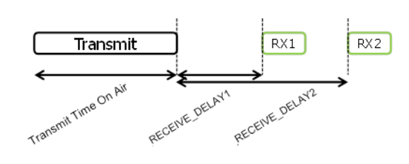

# 第3章 物理消息格式

LoRa 术语区分上行消息和下行消息。

## 3.1 上行消息

**上行消息**是由终端发出，经过一个或多个网关转发给网络服务器。

上行消息使用 LoRa 射频帧的显式模式，消息中包含 LoRa 物理头（LoRa physical heaer, **PHDR**）和一个头校验（**PHDR_CRC**）[^注1]。载荷由CRC校验来保证完整性。

**PHDR**，**PHDR_CRC** 及载荷 **CRC** 字段都通过射频收发器加入。  

上行消息物理层（Uplink PHY）结构:

<table class="lora-table">
   <tr>
      <td>Preamble</td>
      <td>PHDR</td>
      <td>PHDR_CRC</td>
      <td>PHYPayload</td>
      <td>CRC</td>
   </tr>
</table>
<i class="lora-table-name">图2. 上行PHY帧格式</i>

## 3.2 下行消息

下行消息（**downlink message**）是由网络服务器发出，经过单个网关转发给单个终端。[^注2]

下行消息使用射频帧的严格模式，消息中包含 **PHDR** 和 **PHDR_CRC**。[^注3]

下行消息物理层结构:

<table class="lora-table">
   <tr>
      <td>Preamble</td>
      <td>PHDR</td>
      <td>PHDR_CRC</td>
      <td>PHYPayload</td>
   </tr>
</table>
<i class="lora-table-name">图3. 下行PHY帧格式</i>

## 3.3 接收窗口

每个上行传输后终端都要（MUST）开两个短的接收窗口。接收窗口开始时间的规定，是以传输结束时间为参考。

<i class="lora-table-name">图4. 终端接收时隙的时序图</i>

### 3.3.1 第一接收窗的信道，速率和启动

第一接收窗口 RX1 使用的频率和上行频率有关，使用的数据速率和上行速率有关。RX1 是在上行调制结束后的 RECEIVE_DELAY1[^注4] 秒（+/- 20微秒）打开。上行和 RX1 时隙下行速率的关系是按区域规定，详细描述参阅 [PHY-DOC]。默认情况下，第一窗口的速率和最后一次上行的速率相同。

### 3.3.2 第二接收窗的信道，速率和启动

第二接收窗口 RX2 使用一个固定可配置的频率和数据速率，在上行调制结束后的 RECEIVE_DELAY2[^注4] 秒（+/- 20微秒）打开。所用的频率和数据速率可以通过 MAC 命令（见第5章）。默认的频率和速率是按区域规定，详细描述在[PHY-DOC]中。

### 3.3.3 接收窗口持续时间

接收窗口的长度必须（MUST）至少要让终端射频收发器有足够的时间来检测到下行的前导码。

### 3.3.4 接收方在接收窗口期间的活动

如果在任何一个接收窗口中检测到前导码，射频接收器需要继续工作，直到整个下行帧都解调完毕。如果在第一接收窗口检测到数据帧，且解调后确认该数据帧是用于这个终端并且MIC校验通过，那终端就不要（MUST NOT）开启第二个接收窗口。

### 3.3.5 网络发送消息给终端

如果网络打算将下行消息发送到终端设备，它必须（MUST）至少在其中一个接收窗口的起始时间点精确地开始传输。如果在两个窗口开启期间都发送下行消息，则必须（MUST）在每个窗口发送相同的帧。

### 3.3.6 接收窗口的重要事项

终端设备不得（SHALL NOT）发起另一个上行消息，在前一次通讯的第一或第二接收窗口中收到下行消息或者前一次通讯的第二窗口过期失效之前。

### 3.3.7 其他协议的收发处理

节点在 LoRaWAN 传输和接收窗口之间可以（MAY）收发其他协议或进行任何无线电通信交互，只要终端能兼容当地管理规则的要求以及遵守 LoRaWAN 规范。

[^注1]: 有关LoRa无线电数据包隐式/显式模式的说明，请参阅LoRa射频收发器数据表。
[^注2]: 本规范未描述从网络服务器向多个终端设备传输多播消息的情况。
[^注3]: 此级别不进行有效载荷完整性检查，以使消息尽可能短，对所使用的ISM频段的占空比限制的影响最小。
[^注4]: RECEIVE_DELAY1 和 RECEIVE_DELAY2 在第六章详细描述.

