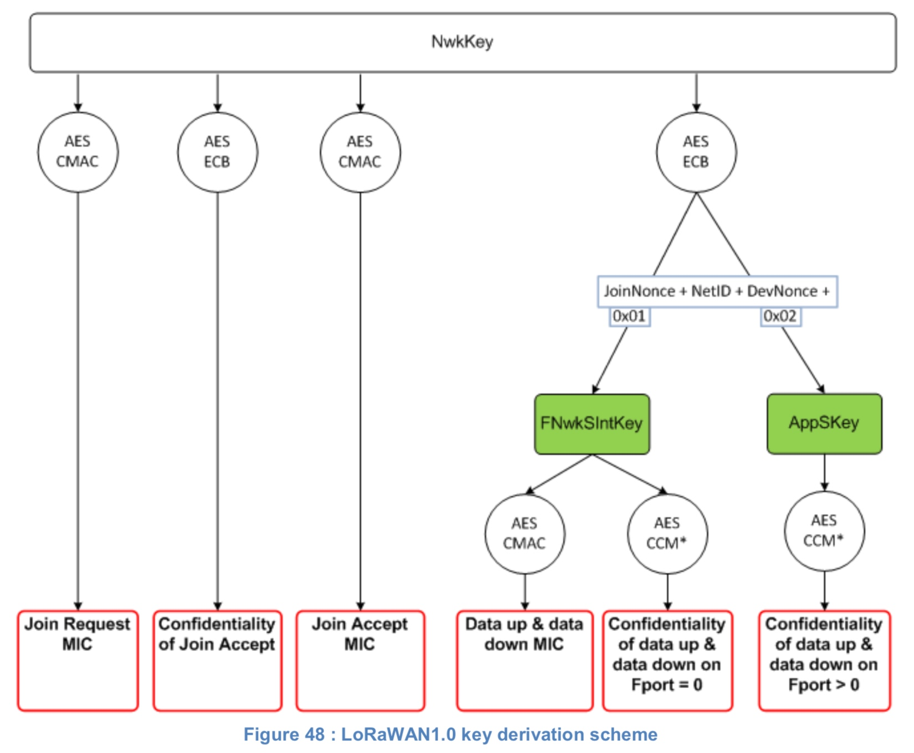

# 第6章 终端激活

为了加入 LoRaWAN 网络，每个终端需要个性化和激活。

终端的激活有两种方式，一种是空中激活 **Over-The-Air Activation**（OTAA），当设备部署和重置时使用; 另一种是个性化激活 **Activation By Personalization**（ABP），此时初始化和激活这两步就在一个步骤内完成。

## 6.1 终端数据存储

### 6.1.1 激活前

#### 6.1.1.1 JoinEUI

**JoinEUI** 是 IEEE EUI64 地址空间中的一个全局应用程序 ID，它唯一地标识能够帮助处理Join 过程和会话密钥派生的 Join 服务器。

对于 OTAA 设备，在执行 Join 过程之前，**JoinEUI** 必须存储在终端设备中。对于仅有 ABP 模式的终端设备，**JoinEUI** 是不需要的。

#### 6.1.1.2 DevEUI

DevEUI 是 IEEE EUI64 地址空间中唯一标识终端设备的全局设备ID。

DevEUI 是网络服务器推荐的唯一设备标识符，无论使用什么激活过程，都可以用来标识在网络上漫游的设备。

对于 OTAA 设备，在执行连接过程之前，**DevEUI** 必须（MUST）存储在终端设备中。ABP 设备不需要将 DevEUI 存储在设备本身中，但是建议（RECOMMENDED）这样做。

> **注意：**建议DevEUI也应该出现在设备标签上，用于设备管理。

#### 6.1.1.3 Device root keys （AppKey & NwkKey）

NwkKey 和 AppKey是指派给指定终端设备的 AES-128 根密钥，在制造期间分配给终端设备 [^注1]。当终端设备通过空中激活加入网络时，NwkKey 用于派生 FNwkSIntKey、SNwkSIntKey 和 NwkSEncKey 会话密钥，AppKey 用于派生 AppSKey 会话密钥。

>**注意：**当使用 v1.1 网络服务器时，应用程序会话密钥只从 AppKey 派生，因此 NwkKey 可以交给网络操作员来管理连接过程，而不会因此让操作员能够窃听应用程序负载数据。

终端设备和后端上根密钥 NwkKey 和 AppKey 的安全配备、存储和使用是解决方案整体安全性的固有要求。这些都留给了实现，不在本文档的讨论范围。但是，此解决方案的元素可能包括SE（安全元素）和 HSM（硬件安全模块）。

为了确保与 LoraWAN 1.0 和不支持两个根密钥的早期网络服务器的向后兼容性，终端设备在加入这样的网络时必须默认返回到单个根密钥方案。在这种情况下，只使用根 NwkKey。该情况由 Join-accept 消息的 DLsetting 字段的“OptNeg”位（第7位）为零向终端设备发出信号。在这种情况下，终端设备必须（MUST）

- 使用 NwkKey 派生 AppSKey 和 FNwkSIntKey 会话密钥，与在 LoRaWAN1.0 规范中一样。
- 将 SNwkSIntKey 和 NwkSEncKey 设置为 FNwkSIntKey，根据 LoRaWAN1.0 规范，同一网络会话密钥可以有效地用于 MAC 载荷的上下行加密和 MIC 计算。

NwkKey 必须（MUST）存储在打算使用 OTAA 过程的终端设备上。

仅有 ABP 模式的终端设备无需 NwkKey。

AppKey 必须（MUST）存储在打算使用 OTAA 过程的终端设备上。

仅有 ABP 模式的终端设备无需 AppKey。

NwkKey 和 AppKey 都应该（SHOULD）以防止恶意行为提取和重用的方式存储。

#### 6.1.1.4 JSIntKey and JSEncKey derivation

对于 OTA 设备，从 NwkKey 根密钥派生出两个特定的生存期密钥：

- JSIntKey 用于 MIC Rejoin-Request type 1 消息和 Join-Accept 应答
- JSEncKey 用于加密由 Rejoin-Request 请求触发的 Join-Accept

JSIntKey = aes128_encrypt(NwkKey, 0x06 | DevEUI | pad16)
JSEncKey = aes128_encrypt(NwkKey, 0x05 | DevEUI | pad16)

### 6.1.2 激活之后

激活后，以下附加信息将存储在终端设备中：设备地址（**DevAddr**）、三个一组的网络会话密钥（**NwkSEncKey** / **SNwkSIntKey** / **FNwkSIntKey**）和应用程序会话密钥（**AppSKey**）。

#### 6.1.2.1 终端设备地址（DevAddr）

终端地址（**DevAddr**）由可标识当前网络中该设备的 32 位 ID 所组成。

格式如下：

<table class="lora-table">
   <tr>
      <td><b>Bit#</b></td>
      <td>[31..32-N]</td>
      <td>[31-N..0]</td>
   </tr>
   <tr>
      <td><b>DevAddr bits</b></td>
      <td>AddrPrefix</td>
      <td>NwkAddr</td>
   </tr>
</table>

*图 43： DevAddr fields*

其中 N 是 [7:24] 范围内的整数。

LoRaWAN 协议支持具有不同网络地址空间大小的多种网络地址类型。可变大小的 AddrPrefix 字段派生自网络服务器的唯一标识符 **NetID**（参阅 6.2.3），该标识符由 LoRa Alliance 分配，但保留用于实验/专用网络的 AddrPrefix 值除外。AddrPrefix 字段允许在漫游期间发现当前管理终端设备的网络服务器。不遵守此规则的设备无法在两个网络之间漫游，因为无法找到它们的宿主网络服务器。

最不重要的（32-N）位，即终端设备的网络地址（NwkAddr），可以由网络管理者任意分配。

下列 AddrPrefix 值可由任何专用/实验网络使用，不会由 LoRa Aliance 分配。

<table class="lora-table">
   <tr>
      <td>Private/experimental network reserved AddrPrefix</td>
   </tr>
   <tr>
      <td><b>N=7</b></td>
   </tr>
   <tr>
      <td><b>AddrPrefix = 7’b0000000 or AddrPrefix = 7’b0000001</b></td>
   </tr>
   <tr>
      <td>NwkAddr = 25bits freely allocated by the network manager</td>
   </tr>
</table>

有关 AddrPrefix 字段的确切构造和各种 address 类的定义，请参考 [BACKEND-DOC]。

#### 6.1.2.2 转发网络会话完整性秘钥（Forwarding Network session integrity key，FNwkSIntKey）

**FNwkSIntKey** 是特定于终端设备的网络会话密钥。它被终端设备用来计算所有上行数据消息的 **MIC**（message integrity code）如章节 4.4 所述。FNwkSIntKey 应该（SHOULD）以防止恶意行为提取和重用的方式存储。

#### 6.1.2.3 服务网络会话完整性秘钥（Serving Network session integrity key，SNwkSIntKey）

**SNwkSIntKey** 是特定于终端设备的网络会话密钥。终端设备使用它来验证所有下行数据消息的 MIC 以确保数据完整性，并计算上行消息 MIC 的一半。

> 注意：计算依赖于两个秘钥（NwkSIntKey 和 SNwkSIntKey），以便允许漫游设置中的转发网络服务器可以只验证 MIC 字段的一半。

当设备连接到 LoRaWAN1.0 网络服务器时，按照章节 4.4 中的说明，上行和下行 MIC 计算使用相同的密钥。在这种情况下，SNwkSIntKey 使用 FNwkSIntKey 相同的值。

**SNwkSIntKey** 应该（SHOULD）以防止恶意行为提取和重用的方式存储。

#### 6.1.2.4 网络会话加密秘钥（Network session encryption key，NwkSEncKey）

**NwkSEncKey** 是特定于终端设备的网络会话密钥。它用于加解密在端口 0 载荷或 FOpt 字段中发送的上行和下行 MAC 指令。

当设备连接到 LoRaWAN1.0 网络服务器时，MAC 有效载荷加密和 MIC 计算都使用相同的密钥。此种情况 NwkSEncKey 使用 FNwkSIntKey 相同的值.
**NwkSEncKey** 应该（SHOULD）以防止恶意行为提取和重用的方式存储。

#### 6.1.2.5 应用会话秘钥（Application session key，AppSKey）

**AppSKey** 是特定于终端设备的应用程序会话密钥。应用服务器和终端设备都使用它来加密和解密特定于应用程序的数据消息的载荷字段。应用载荷负载在终端设备和应用程序服务器之间进行端到端加密，但它们仅以 hop-by-hop 的方式进行完整性保护：终端设备和网络服务器之间的一跳，以及网络服务器和应用服务器之间的另一跳。

这意味着，恶意网络服务器可能能够更改传输中的数据消息的内容，这甚至可能帮助该网络服务器通过观察应用程序端点对更改后的数据的反应来推断一些关于这些数据的信息。网络服务器被认为是可信的，但是希望实现端到端机密性和完整性保护的应用程序可以使用额外的端到端安全解决方案，这超出了本规范的范围。

**AppSKey** 应该（SHOULD）以防止恶意行为提取和重用的方式存储。

#### 6.1.2.6 会话上下文

会话上下文包含网络会话和应用会话。

网络会话由以下状态组成：

* F/SNwkSIntKey
* NwkSEncKey
* FCntUp
* FCntDwn (LW 1.0) or NFCntDwn (LW 1.1) 
* DevAddr

应用会话由以下状态组成：

* AppSKey
* FCntUp
* FCntDown (LW 1.0) or AFCntDwn (LW 1.1)

网络会话状态由 NS 和终端设备维护。应用程序会话状态由 AS 和终端设备维护。

在完成 OTAA 或 ABP 过程之后，在 NS/AS 和终端设备之间建立了一个新的安全会话上下文。密钥和终端设备地址在会话期间是固定的（FNwkSIntKey、SNwkSIntKey、AppSKey、DevAddr）。

会话期间交换帧流量时，帧计数器增加（FCntUp、FCntDwn、NFCntDwn、AFCntDwn）

对于OTAA设备，不能（MUST NOT）对给定 Key 重用帧计数器，因此必须（MUST）在帧计数器饱和之前很好地建立新的会话上下文。

建议（RECOMMENDED）在终端设备的电源循环过程中保持会话状态。如果 OTAA 设备不能这样做，则意味着需要在设备每次电源循环时执行激活过程。

## 6.2 空中激活 OTAA

对于空中激活，终端设备在与网络服务器进行数据交换之前必须执行连接过程。终端设备每次丢失会话上下文信息时都必须执行一个新的连接过程。

如上所述，连接过程要求终端设备在开始连接之前使用以下信息进行个性化处理：DevEUI、JoinEUI、NwkKey 和 AppKey。

>注意：对于空中激活，终端设备不使用一对网络会话密钥进行个性化。相反，每当终端设备加入网络时，特定于该终端设备的网络会话密钥才会被派生出来以加密和验证网络级别上的传输。这样，终端设备在不同提供者的网络之间漫游更加便利。使用不同的网络会话密钥和应用程序会话密钥进一步允许联盟网络服务器中应用程序数据不能被网络提供者读取。

### 6.2.1 连接过程

从终端设备视角来看，连接过程由一对 MAC 指令的交互组成， **Join** 或 **Rejoin-Request**，和  **Join-Accept**。

### 6.2.2 Join-request message

连接过程总是从终端设备通过发送 Join-Request 消息发起。

<table class="lora-table">
   <tr>
      <td><b>Size (bytes)</b></td>
      <td>8</td>
      <td>8</td>
	  <td>2</td>
   </tr>
   <tr>
      <td><b>Join Request</b></td>
      <td>JoinEUI</td>
      <td>DevEUI</td>
	  <td>DevNonce</td>
   </tr>
</table>

*Figure 44 : Join-request message fields*

Join-Request 消息包含终端设备的 **JoinEUI** 和 **DevEUI**，后面跟着一个由 2 个八位元构成的 nonce（**DevNonce**）

**DevNonce** 是一个当设备最初上电从 0 开始的计数器，并随着每个 Join-Request 递增。对于给定的 JoinEUI 值，不能（SHALL NEVER）重复使用 DevNonce。如果终端设备可以进行电源循环，那么 DevNonce 应该（SHALL）是持久化的（存储在非易失性内存中）。在不更改 JoinEUI 的情况下重置 DevNonce 将导致网络服务器丢弃设备的连接请求。对于每个终端设备，网络服务器跟踪该设备使用的最后一个 DevNonce 值，如果不增加 DevNonce，则忽略连接请求。

>注意：该机制防范试图通过发送先前记录的 Join-Request 消息将相应设备与网络断开的重播攻击。任何时候网络服务器处理一个 Join-Request 并生成一个 Join-Accept 帧时，应当（SHALL）同时维护新旧安全上下文（秘钥和计数器，如果有的话），直到它接收到第一个成功的包含使用新的上下文的 ***RekeyInd*** 指令的上行帧，旧的上下文可以安全地删除。

Join-Request 消息的完整性代码 MIC 值（MAC 消息描述参阅第 4 章）计算如下：[^注2]

- *cmac* = aes128_cmac(NwkKey, MHDR | JoinEUI | DevEUI | DevNonce)
- MIC = *cmac*[0..3]

Join-Request 消息不做加密。Join-Request 消息可以使用任意的数据速率，并遵循指定连接通道上的随机跳频序列进行传输。建议（RECOMMENDED）使用多个数据速率。**Join-Request** 之间的传输间隔应符合第 7 章中描述的条件。对于 **Join-Request** 的每次传输，终端设备应（SHALL）增加 DevNonce 值。

### 6.2.3 Join-accept message

如果允许终端设备加入网络，网络服务器将使用 **Join-Accept** 消息响应 **Join** 或 **Rejoin-Request** 消息。消息如同像普通下行通讯一样发送，但是使用 JOIN_ACCEPT_DELAY1 或 JOIN_ACCEPT_DELAY2 延迟（而不是 RECEIVE_DELAY1 和 RECEIVE_DELAY2）。用于这两个接收窗口的通道频率和数据速率与在 [PHY-DOC] “接收窗口”一节中描述的用于 RX1 和 RX2 接收窗口的通道频率和数据速率相同。

如果加入请求不被接受，则不会向终端设备提供响应。

Join-accept 消息包含一个服务器 nonce（**JoinNonce**，3个八位字节），一个网络标识符（**NetID**），一个终端设备地址（**DevAddr**），一个（**DLSettings**）字段提供一些下行参数、TX 和 RX 之间的延迟（**RxDelay**）和网络终端设备连接的网络的可选的网络参数列表（**CFList**）。可选 CFList 字段是特定于区域的，在 [PHY-DOC] 中定义。

<table class="lora-table">
   <tr>
      <td><b>Size (bytes)</b></td>
      <td>3</td>
      <td>3</td>
      <td>4</td>
      <td>1</td>
      <td>1</td>
      <td>(16)Optional</td>
   </tr>
   <tr>
      <td><b>Join Accpet</b></td>
      <td>JoinNonce</td>
      <td>Home_NetID</td>
      <td>DevAddr</td>
      <td>DLSettings</td>
      <td>RXDelay</td>
      <td>CFList</td>
   </tr>
</table>

*Figure 45: Join-accept message fields*

**JoinNonce** 是连接服务器提供的特定于设备的计数器值（从不重复），终端设备使用它派生会话密钥 **FNwkSIntKey**、**SNwkSIntKey**、**NwkSEncKey** 和 **AppSKey**。JoinNonce 随每个Join-accept 消息递增。

设备跟踪最后一个成功处理的 Join-accept 中使用的 JoinNonce 值（对应于最后一个成功的密钥派生）。设备应（SHALL）仅接受 MIC 字段正确 JoinNonce 严格大于所记录的值的 Join-Accept。这时，新的 JoinNonce 值将替换之前存储的值。

如果设备容易受到电源循环的影响，则 JoinNonce 应该是持久化的（存储在非易失性内存中）。

LoRa 联盟为所有网络分配了一个 24 位的唯一网络标识符（NetID），以下 NetID 值除外，它们保留给未受管理的实验性或私有网络。

有 2^15 个私有/实验网络保留的 NetID 值，构建如下:

<table class="lora-table">
   <tr>
      <td><b>NB bits</b></td>
      <td>3</td>
      <td>14</td>
      <td>7</td>
   </tr>
   <tr>
      <td></td>
      <td>3’b000</td>
      <td>XXXXXXXXXXXXXX Arbitrary 14bit value</td>
      <td>7’b0000000 Or 7’b0000001</td>
   </tr>
</table>

Join-accept 帧的 home_NetID 字段对应于设备的宿主网络的 NetId。

在漫游场景中，分配 devAddr 的网络和宿主网络可能不同。如需更准确的数据，请参考 [BACKEND-DOC]。

DLsettings 字段包含下行配置:

**DLsettings**字段包含了下行配置:

<table class="lora-table">
   <tr>
      <td><b>Bits</b></td>
      <td>7</td>
      <td>6:4</td>
      <td>3:0</td>
   </tr>
   <tr>
      <td><b>DLsettings</b></td>
      <td>OptNeg</td>
      <td>RX1DRoffset</td>
      <td>RX2 Data rate</td>
   </tr>
</table>

OptNeg 标志位位指示网络服务器实现了 LoRaWAN1.0 协议版本（未设置）还是 1.1 和更新的版本（设置）。当 OptNeg 标志位是设置的状态时：

- 协议版本在终端设备和网络服务器之间通过 ***RekeyInd/RekeyConf*** MAC 指令交互进行进一步协商（1.1或更高版本）
- 设备从NwkKey 派生出 **FNwkSIntKey** & **SNwkSIntKey** & **NwkSEncKey**
- 设备从 **AppKey** 派生 **AppSKey**

当 OptNeg 标志位没有设置时：

* 设备恢复为 LoRaWAN1.0，没有可协商选项
* ***RekeyInd*** 命令不由设备发送
* 设备从 NwkKey 派生出**FNwkSIntKey** 和 **AppSKey**
* 设备将 **SNwkSIntKey** 和 **NwkSEncKey** 设置为 **FNwkSIntKey**

4 个会话密钥 **FNwkSIntKey**，**SNwkSIntKey**，**NwkSEncKey** 和 **AppSKey** 派生如下:

如果 OptNeg 未设置，则会话密钥从 NwkKey 派生如下:

- AppSKey = aes128_encrypt(NwkKey, 0x02 | JoinNonce | NetID | DevNonce | pad16 [^注3])
- FNwkSIntKey = aes128_encrypt(NwkKey, 0x01 | JoinNonce | NetID | DevNonce | pad16)
- SNwkSIntKey = NwkSEncKey = FNwkSIntKey.

Join-Accept 消息的 MIC 值计算如下：[^注2]

- *cmac* = aes128_cmac(**NwkKey**, MHDR | JoinNonce | NetID | DevAddr | DLSettings | RxDelay | CFList )
- MIC = *cmac*[0..3]

否则如果 OptNeg 有置位，AppSKey 以如下方式从 AppKey 派生：

- AppSKey = aes128_encrypt(AppKey, 0x02 | JoinNonce | JoinEUI | DevNonce | pad16)

网络会话秘钥从 NwkKey 派生：

- FNwkSIntKey = aes128_encrypt(NwkKey, 0x01 | JoinNonce | JoinEUI | DevNonce | pad16)
- SNwkSIntKey = aes128_encrypt(NwkKey, 0x03 | JoinNonce | JoinEUI | DevNonce | pad16)
- NwkSEncKey = aes128_encrypt(NwkKey, 0x04 | JoinNonce | JoinEUI | DevNonce | pad16)

这种情况 MIC 值这样计算：[^注2]

- *cmac* = aes128_cmac(**JSIntKey**, JoinReqType | JoinEUI | DevNonce | MHDR | JoinNonce | NetID | DevAddr | DLSettings | RxDelay | CFList )
- MIC = *cmac*[0..3]

JoinReqType 是一个单字节字段，编码触发 Join-accept 响应的 Join-request 或 Rejoin-request 的类型。

<table>
    <tr>
        <td>Join-request or Rejoin-request type</td>
        <td>JoinReqType value</td>
    </tr>
    <tr>
        <td>Join-request</td>
        <td>0xFF</td>
    </tr>
    <tr>
        <td>Rejoin-request type 0</td>
        <td>0x00</td>
    </tr>
    <tr>
        <td>Rejoin-request type 1</td>
        <td>0x01</td>
    </tr>
    <tr>
        <td>Rejoin-request type 2</td>
        <td>0x02</td>
    </tr>
</table>

*Table 13 : JoinReqType values*

用于加密 Join-Accept 消息的密钥是触发该消息的 Join 或 ReJoin-Request 消息的功能。

<table>
    <tr>
        <td>Triggering Join-request or Rejoin-request type</td>
        <td>Join-accept Encryption Key</td>
    </tr>
    <tr>
        <td>Join-request</td>
        <td><b>NwkKey</b></td>
    </tr>
    <tr>
        <td>Rejoin-request type 0 or 1 or 2</td>
        <td><b>JSEncKey</b></td>
    </tr>
</table>

*Table 14: Join-Accept encryption key*

Join-Accept 消息以如下方式加密：

- aes128_decrypt(**NwkKey** or **JSEncKey**, JoinNonce | NetID | DevAddr | DLSettings | RxDelay | CFList | MIC)

该消息长度为 16 或 32 字节。

>注意：ECB 模式下的 AES 解密操作用于加密 Join-Accept 消息，以便终端设备可以使用 AES 加密操作解密消息。这样，终端设备只需要实现AES加密，而不需要AES解密。
>注意：建立这四个会话密钥允许网络服务器联盟基础设施，其中网络运营商不能窃听应用程序数据。应用程序提供者向网络运营商承诺，它将承担终端设备产生的任何流量的费用，并保留对用于保护其应用程序数据的 **AppSKey** 的完全控制。
>注意：设备的协议版本（1.0或1.1）与 DevEUI 和设备的 NwkKey，可能还有AppKey，同时在带外后端注册

RX1DRoffset 字段设置上行数据速率与用在第一个接收槽（RX1）上与终端设备通信的下行数据速率之间的偏移量。默认情况下，这个偏移量为0。偏移量用于应对某些地区基站的最大功率密度限制，并平衡上下行无线电链路的裕度。

上下行数据速率之间的实际关系是特定于区域的，并在 [PHY-DOC] 中详细说明。

延迟 **RxDelay** 遵循与 ***RXTimingSetupReq*** 命令中的 **Delay** 字段相同的约定。

如果 Join-Accept 消息在以下传输之后接收到的:

- Join-Request 或 Rejoin-request 类型 0 或 1，并且如果缺少 CFlist 字段，则设备应（SHALL）恢复到其默认通道定义。如果 CFlist 存在，它将覆盖当前定义的所有通道。MAC 层参数（Join-Accept 消息传输的 RXdelay1、RX2 数据速率和 RX1 DR 偏移量除外）都应（SHALL）重置为默认值。
- Rejoin-request 类型2，如果 CFlist 字段不存在，则设备应保持其当前通道定义不变。如果 CFlist 存在，它将覆盖当前定义的所有通道。所有其他 MAC 参数（被重置的帧计数器除外）保持不变。

在所有成功处理 Join-accept 消息之后，设备应（SHALL）发送 ***RekeyInd*** MAC 指令，直到接收到 ***RekeyConf*** 指令（见5.9）。网络服务器以收到 ***RekeyInd*** 上行指令作为切换到新的安全上下文的信号。

### 6.2.4 ReJoin-request message

一旦被激活，设备可以（MAY）在其正常的应用流量之上周期性地发送一个 Rejoin-Request 消息。这个 Rejoin-request 消息周期性地为后端提供了为终端设备初始化新会话上下文的机会。为此，网络使用J oin-Accept 消息进行响应。这可以用于在两个网络之间移交设备，或者在给定网络上重设密钥和/或更改设备的 devAddr。

网络服务器也可以使用 Rejoin-request RX1/RX2 窗口来传输一个正常的已确认或未确认的下行帧并可选地携带 MAC 指令。这种可能性对于在设备和网络服务器之间存在 MAC 层状态反同步时重置设备的接收参数很有用。

例如：该机制可用于对使用当前下行配置的下行通讯中无法再访问的设备更改 RX2 窗口数据速率和 RX1 窗口数据速率偏移量。

Rejoin 过程总是通过发送一条 Rejoin-request 消息从终端设备启动。

>注意：任何时候网络后端处理 ReJoin-Request（类型0、1或2）并生成 Join-accept 消息时，应当同时维护新旧安全上下文（秘钥和计数器，如果有的话），直到它接收到第一次成功使用新的上下文的上行帧之后，旧的安全上下文可以被安全地丢弃。在所有情况下，网络端处理 ReJoin-request 消息的过程类似于处理标准的 Join-Request 消息，在网络服务器初步处理信息并决定是否应该转发给入网服务器来创建一个 Join-Accept 消息作为回应。

有三种类型的 Rejoin-Request 消息可以通过终端设备发送，它们对应于三个不同的目的。Rejoin-request 消息的第一个字节称为 Rejoin Type，用于编码 Rejoin-request 的类型。下表描述了每种 Rejoin-Request 消息类型的用途

<table>
    <tr>
        <td>RejoinReq type</td>
        <td>Content & Purpose</td>
    </tr>
    <tr>
        <td>0</td>
        <td>包含 NetID + DevEUI。用于重置设备上下文，包括所有的无线电参数（devAddr、会话键、帧计数器、无线电参数……）。此消息只能由接收网络服务器路由到设备的主网络服务器，而不能路由到设备的 JoinServer，此消息的 MIC 只能由服务中或主网络服务器验证。</td>
    </tr>
    <tr>
        <td>1</td>
        <td>包含 JoinEUI + DevEUI。与最初的 Join-Request 消息完全相同，但可以在正常应用程序流量之上传输，而不需要断开设备。只能由接收网络服务器路由到设备的 JoinServer。用于恢复丢失的会话上下文（例如，网络服务器丢失了会话密钥，无法将设备关联到 JoinServer）。只有JoinServer 能够检查此消息的 MIC。</td>
    </tr>
    <tr>
        <td>2</td>
        <td>用于重设设备密钥或更改其 DevAddr（DevAddr、会话密钥、帧计数器）。无线电参数保持不变。此消息只能通过已访问的网络路由到设备的主网络服务器，而不能路由到设备的 Join 服务器。此消息的 MIC 只能通过服务中或主网络服务器进行验证。</td>
    </tr>
</table>

*Table 15 : summary of RejoinReq messages*

#### 6.2.4.1 ReJoin-request Type 0 or 2 message

<table class="lora-table">
    <tr>
        <td><b>Size (bytes)</b></td>
        <td>1</td>
        <td>3</td>
        <td>8</td>
        <td>2</td>
    </tr>
    <tr>
        <td><b>Rejoin-request</b></td>
        <td>Rejoin Type = 0 or 2</td>
        <td>NetID</td>
        <td>DevEUI</td>
        <td>RJcount0</td>
    </tr>
</table>

*Figure 46: Rejoin-request type 0&2 message fields*

Rejoin-request 类型 0 或 2 消息包含 NetID（设备的主网络标识）和终端设备的DevEUI，后面跟着一个16位计数器（RJcount0）。

是一个计数器，随每次发送类型 0 或 2 的 Rejoin 帧递增。

每次终端设备成功处理 Join-Accept 时，RJcount0 被初始化为0。对于每个终端设备，网络服务器必须（MUST）跟踪终端设备使用的最后一个 RJcount0 值（称为RJcount0_last）。如果（Rjcount0 <= RJcount0_last）该 Rejoin-Request 会被忽略。

RJcount0 永远不应（SHALL never）折返。如果 RJcount0 达到2^16-1，则设备应停止发送 ReJoin-request 类型 0 或 2 的帧。设备可能（MAY）会回到 Join 状态。

>注意：该机制防范通过发送以前记录的 Rejoin-request 消息进行的重播攻击

Rejoin-request 消息的消息完整性代码（MIC）值计算如下（MAC 消息描述见第4章）:[^注2]

- cmac = aes128_cmac(SNwkSIntKey, MHDR | Rejoin Type | NetID | DevEUI | RJcount0)
- MIC = cmac[0..3]

Rejoin-request 消息没有加密。

设备的类型 0 或 2 的 Rejoin-Req 传输占空比应始终小于0.1%

>注意：Type 0 Rejoin-Request 消息应该根据设备的用例，从每小时一次传输到每隔几天一次。此消息也可以跟随 ***ForceRejoinReq*** MAC 指令传输。此消息可用于在漫游情况下将移动设备重新连接到已访问的网络。它还可以用来重设密钥或更改固定设备的 devAddr。希望在网络间漫游的移动设备应该比固定设备更频繁地发送此消息。

>注意：Type 2 Rejoin-Request 消息仅用于启用终端设备的密钥重置。此消息只能跟随 ***ForceRejoinReq*** MAC 指令传输。

#### 6.2.4.2 ReJoin-request Type 1 message

与 Join-Request 类似，Rejoin-Request type 1 消息包含终端设备的 JoinEUI 和 DevEUI。因此，任何接收到 Rejoin-Request type 1 消息的网络服务器都可以将该消息路由到终端设备的 Join 服务器。Rejoin-request type 1 可用于在网络服务器完全失去状态时恢复与终端设备的连接。建议每月至少发送一次 Rejoin-Request type 1 消息。

<table class="lora-table">
    <tr>
        <td><b>Size (bytes)</b></td>
        <td>1</td>
        <td>8</td>
        <td>8</td>
        <td>2</td>
    </tr>
    <tr>
        <td><b>Rejoin-request</b></td>
        <td>ReJoin Type = 1</td>
        <td>JoinEUI</td>
        <td>DevEUI</td>
        <td>RJcount1</td>
    </tr>
</table>

*Figure 47: Rejoin-request type 1 message fields*

用于 Rejoin-request type 1 的 RJcount1 是不同于 Rejoin-request type 0 的 RJCount0 的计数器。

RJcount1 是随着每个 Rejoin-request type 1 帧的传输而递增的计数器。对于每个终端设备，Join 服务器跟踪终端设备使用的最后一个 RJcount1 值（称为 RJcount1_last）。如果（Rjcount1 <= RJcount1_last），它将忽略 Rejoin-requests。

对给定的 JoinEUI， RJcount1 永远不会（SHALL never）折返。Rejoin-Request type 1 的传送周期应该是这样的：对于给定的 JoinEUI 值，这种封装不会在设备的生命周期内发生。

>注意：该机制防范通过发送以前记录的 Rejoin-request 消息进行的重播攻击

Rejoin-request-Type1 消息的消息完整性代码（MIC）值计算如下（MAC消息描述见第4章）:[^注2]

- *cmac* = aes128_cmac(JSIntKey, MHDR | RejoinType | JoinEUI| DevEUI | RJcount1)
- MIC = *cmac*[0..3]

Rejoin-request-type 1 消息不被加密。

设备的 Rejoin-Req type 1 传输占空比应始终小于0.01%

>注意：Rejoin-Request type 1 消息发送周期应该从一天一次到一周一次。此消息仅在完全丢失服务器端上下文的情况下使用。该事件不太可能延迟1天到1周来重新连接设备，因此被认为是合适的。

#### 6.2.4.3 Rejoin-Request transmissions

 下表总结了传送每种 Rejoin-request 类型消息的可能条件。

<table class="lora-table">
    <tr>
        <td>RejoinReq type</td>
        <td>Transmitted autonomously & periodically by the end-device</td>
        <td>Transmitted following a ForceRejoinReq MAC command</td>
    </tr>
    <tr>
        <td>0</td>
        <td>x</td>
        <td>x</td>
    </tr>
    <tr>
        <td>1</td>
        <td>x</td>
        <td></td>
    </tr>
    <tr>
        <td>2</td>
        <td></td>
        <td>x</td>
    </tr>
</table>

*Table 16 : transmission conditions for RejoinReq messages*

Rejoin-Request type 0&1 消息应（SHALL）按照随机跳频序列在任何已定义的连接信道（参见 [PHY-DOC]）上传输。

Rejoin-Request type 2 应（SHALL）按照随机跳频序列在当前启用的任何信道上传输。

跟随 ***ForceRejoinReq*** 指令传输的 Rejoin-Request type 0 或 2 应（SHALL）使用 MAC 指令中指定的数据速率。

Rejoin-Request type 1 和终端设备定期（使用 ***RejoinParamSetupReq*** 指令设置最大周期）自主传输的 Rejoin-Request type 0 应使用: 

- 如果启用ADR，当前用于传输应用程序载荷的数据速率和TX功率
- 如果禁用ADR，则是连接信道上允许的任何数据速率和默认TX电源。在这种情况下，建议使用多个数据速率。

#### 6.2.4.4 Rejoin-Request message processing

对于所有3种 Rejoin-Request 类型，网络服务器的响应可能是:

- 一个 join-accept 消息（如 6.2.3 中定义），如果它想修改设备的网络标识（漫游或秘钥重置）。在这种情况下，RJcount（0或1）取代秘钥派生过程中的DevNonce
- 一个普通的下行帧，可选地包含 MAC 指令。该下行应在（SHALL）相同的信道上发送，具有与它取代的 Join-accept 消息相同的数据速率和延迟。

在大多数情况下，在 ReJoin-Request 类型 0 或 1 之后，网络将不会响应。

### 6.2.5 密钥派生图表

下面的图表总结了设备连接到 LoRaWAN1.0 或 1.1 网络服务器的情况下的秘钥派生方案。

**LoRaWAN1.0 network backend:**

当一个 LoRaWAN1.1 设备分配给了LoRaWAN1.0.X 的网络后端，所有密钥都从 NwkKey 根密钥派生。设备的AppKey 不被使用。

**LoRaWAN1.1 network backend:**

## 6.3 个性化激活 ABP

个性化激活直接将终端设备连接到特定的网络，绕过 **Join-Request - Join-Accept** 过程。

通过个性化激活终端设备意味着 **DevAddr** 和四个会话密钥 **FNwkSIntKey**、**SNwkSIntKey**、**NwkSEncKey** 及 **AppSKey** 直接存储在终端设备中，而不是在连接过程中从 **DevEUI**、**JoinEUI**、**AppKey** 及 **NwkKey** 派生。终端设备一旦启动，就配备了参与特定 LoRa 网络所需的信息。

每个设备都应（SHALL）有一组独特的 **F/SNwkSIntKey**、**NwkSEncKey** 和 **AppSKey**。泄露任何一个设备的密钥不得（SHALL NOT）危害其他设备的通信安全。构建这些密钥的过程应（SHALL）确保密钥不能以任何方式从公开可用的信息派生（例如节点地址或终端设备的 devEUI）。

当个性化终端设备首次访问网络或重新初始化之后，它应（SHALL）在所有上行消息的 FOpt 字段中发送 ***ResetInd*** MAC 指令，直到从网络接收到 ***ResetConf*** 指令。重新初始化后，终端设备必须（MUST）使用其默认配置（标识设备首次连接到网络时使用的配置）。

>**注意：**帧计数器值应（SHALL）在CCM操作模式下对同一秘钥的所有调用中仅使用一次。因此，禁止重新初始化 ABP 模式终端设备的帧计数器。ABP 设备必须（MUST）使用非易失性内存来存储帧计数器。

>ABP 设备在其整个生命周期使用相同会话秘钥（即，不可能秘钥更新）。因此，建议将 OTAA 设备用于更高安全性要求的应用程序。

[^注1]: 由于所有终端设备都配备了特定于每个终端设备的唯一应用程序和网络根密钥，因此从终端设备提取 AppKey/NwkKey 只会损害这一个终端设备。
[^注2]: [RFC4493-DOC]
[^注3]: The pad16 function appends zero octets so that the length of the data is a multiple of 16 

