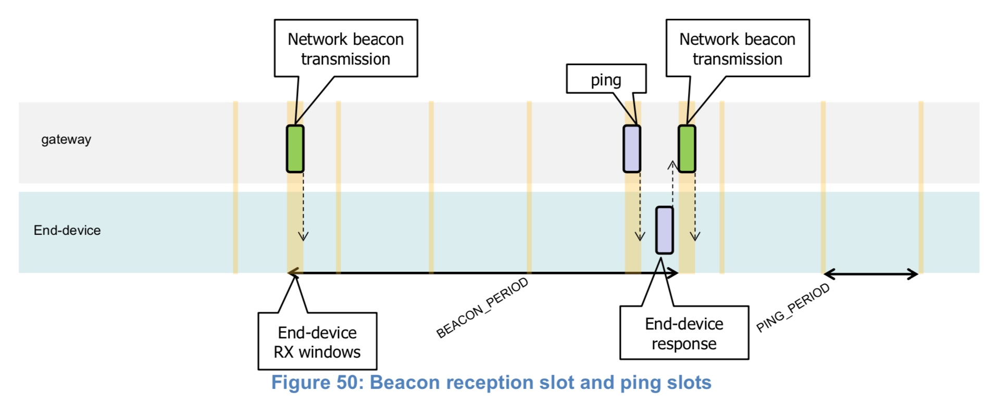

# 第9章 下行同步网络的原理

对于一个支持 Class B 的网络，所有网关必须同步广播一个信标，给所有终端提供一个参考时间。基于这个时间参考，终端可以周期性地打开接收窗口（下文称之为“ping slots”）可被网络设施用于发起下行通信。

网络使用 ping slots 其中之一来发起下行通讯的行为，称之为“ping”。用来发起下行通讯的网关，是网络服务器根据终端最近一次上行包的信号传输质量来选择的。基于此，如果终端根据广播的信标帧发现网络发生了切换（通信的网关发生了变化），它必须发一个上行帧给网络服务，以使服务端更新下行路径数据库。

在设备可以以 Class B 模式运行之前，以下信息必须对带外网络服务器有效：

- 设备的默认 ping-slot 周期
- 默认 ping-slot 数据速率
- 默认 ping-slot 信道

所有终端均以 Class A 启动并加入网络。之后终端应用层可以切换到Class B。这通过以下步骤来完成：

- 终端应用层请求 LoRaWAN 层切换到 Class B 模式。终端的 LoRaWAN 层搜索信标帧，如果搜索到并且锁定了信标帧，那么就向应用层返回 BEACON_LOCKED 的服务原语，反之则返回 BEACON_NOT_FOUND 服务原语。为加快信标帧的发现，LoRaWAN 层可以使用“***DeviceTimeReq***”MAC命令。

- 一旦处于 Class B 模式，MAC 层把每个上行帧的 FCTRL 中 Class B 位置为1。这个位用来通知服务，设备已经切换到 Class B 模式。MAC 层会给每个信标和 ping slot 安排接收时隙。当成功接收信标，终端的 LoRaWAN 层将会转发信标内容给应用层，同时携带实测射频信号强度。终端的 LoRaWAN 层在安排信标和ping时隙时，需要考虑可能的最大时钟偏移。当在 ping 时隙成功解调出下行帧，它的处理和 Class A 的方式类似。
 
- 移动终端必须周期性地通知网络服务其位置信息以更新下行路径。这通过发送普通的（可能为空）“unconfirmed”或者“confirmed”上行包来实现。终端的 LoRaWAN 层会适当地将帧 FCtrl 字段的 Class B 位设置为 1。如果应用程序通过分析信标内容检测到节点正在移动，那么最优情况下这可以更有效地完成。这种情况下终端需要在信标接收后随机延时一段时间（具体见章节15.5）再上行，避免系统上行冲突。

- 网络服务器可以随时通过发送 ***PingSlotChannelReq*** MAC 指令来更改设备的 ping时隙下行频率或数据速率。

- 设备可以随时改变其 ping 时隙的周期。为达成此目的，它必须（MUST）暂时停止 Class B （在其上行链路帧中取消设置 class B 位）并发送一个 ***PingSlotInfoReq*** 命令给网络服务器。一旦该命令被确认，设备就可以用新的 ping 时隙周期重启 Class B 操作。

- 如果在指定周期内没有接收到信标（具体见章节12.2），则意味着网络同步丢失。MAC 层必须通知应用层切换回 Class A。随后终端在上行帧的 LoRaWAN 层中将不再设置 Class B 位，这会告诉网络服务器终端不再处于 Class B 模式。终端的应用程序可以周期性地尝试切换回 Class B。这将从信标搜索开始重新启动此过程。

下图展示了信标接收时隙和 ping-slot 的概念。

*Figure 50: Beacon reception slot and ping slots*

在这个示例中，指定信标周期是 128 秒，终端设备也在每 32 秒打开一个 ping 接收时隙。大多数情况下，这个 Ping 时隙并未被服务器所使用，因此一旦无线电收发器评估到无线电频道上没有出现前导码，终端设备接收窗口就会关闭。如果检测到前导码，则射频会持续接收，直到下行帧解调完毕。随后 MAC 层将处理该帧，在将其转发给应用层之前检查其地址字段是否与终端设备地址匹配，以及消息完整性检查是否有效。

