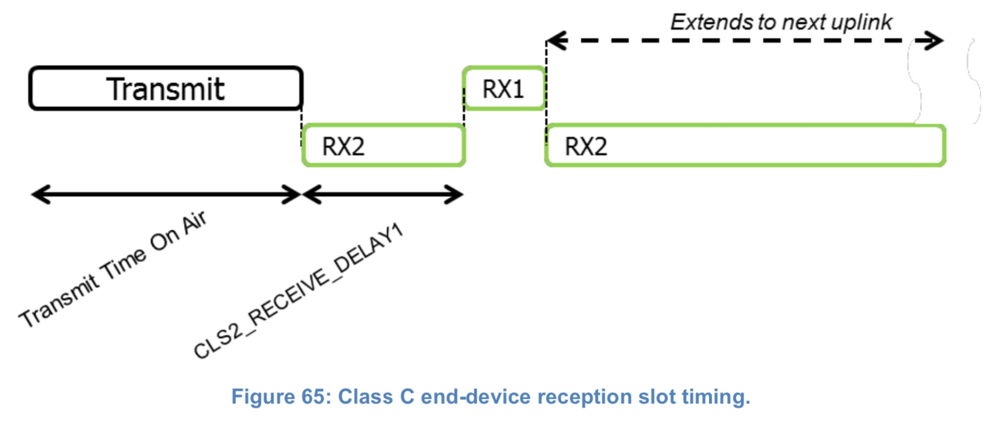

# 第17章 持续接收的终端

具备 Class C 能力的终端，通常应用于供电充足的场景，因此不必最小化接收时间。

Class C 的终端不能（SHALL NOT）执行 Class B。

Class C 终端会尽可能经常地使用 RX2 窗口参数来监听。按照 Class A 的规定，终端是没有 (a) 发送 或 (b) 在 RX1 接收时才会（SHALL）监听 RX2。为这样，终端会在上行发送结束和 RX1 接收窗口开启之前，打开一个短暂的 RX2 窗口，一旦 RX1 接收窗口关闭，终端要（MUST）立即切换到 RX2 接收状态； RX2 接收窗口必须（MUST）保持打开，直到终端需要发送其他消息。

> **注意**：如果设备正在使用 RX2 参数对下行通信解调，当要打开 RX1 窗口时，应终止解调并切换到 RX1 接收窗口
>
> **注意**：没有规定节点必须要告诉服务端它是 Class C 节点。这完全取决于服务端的应用程序，它们可以在 join 流程通过协议交互来获知是否是 Class C 节点。

如果 Class C 模式下的设备接收到需要上行传输的消息（DL MAC 命令请求或确认模式下的 DL 消息），设备应在终端设备和网络服务器都知道的时间内响应（out-of-band provisioning information）。

在超时到期之前，网络不能（SHALL NOT）向设备发送任何新的确认消息或 MAC 指令。一旦超时到期或接收到任何上行消息后，允许网络发送新的DL消息。

## 17.1 Class C 的第二接收窗口持续时间

Class C 设备执行和 Class A 一样的两个接收窗口，但它们不关闭 RX2 直到需要再次发送数据。因此它们几乎可以在任意时间用 RX2 来接收下行消息，包括 MAC 命令和 ACK 发出的下行消息。另外在发送结束和 RX1 开启之间也以 RX2 的频率和数据速率打开了一个短暂的监听窗口。

<i class="lora-table-name">图65. Class C 终端的接收时隙时序图</i>

## 17.2 Class C 对多播下行的处理

和 Class B 类似，Class C 设备也可以接收多播下行帧。多播地址和相关的网络会话秘钥及应用会话秘钥都需要从应用层获取。Class C 多播下行帧也有相同的限制：

- 不能（SHALL NOT）携带 MAC 指令，既不能放在 **FOpts** 域中，也不能放在 port 0 的 payload 中，因为多播下行无法像单播帧那样具备相同的鲁棒性。

- **ACK** 和 **ADRACKReq** 位必须（MUST）要为0。**MType** 域必须（MUST）携带 Unconfirmed Data Down 的值。

- **FPending** 位表明有更多的多播数据要发送。考虑到 Classs C 设备在大部分时间处于接收状态，**FPending** 位不触发终端的任何特殊行为。

