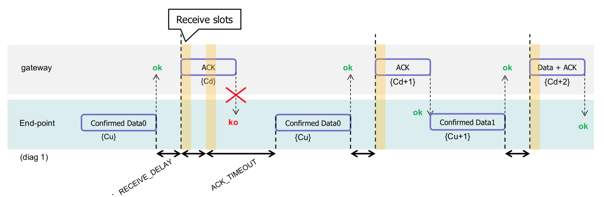
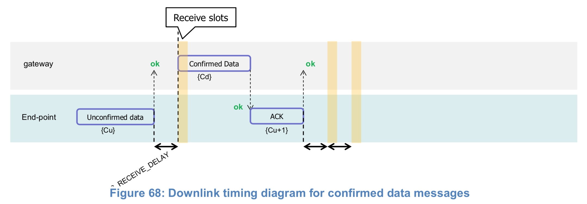
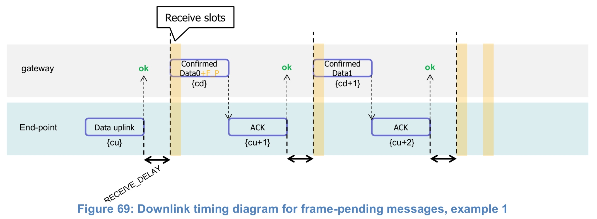
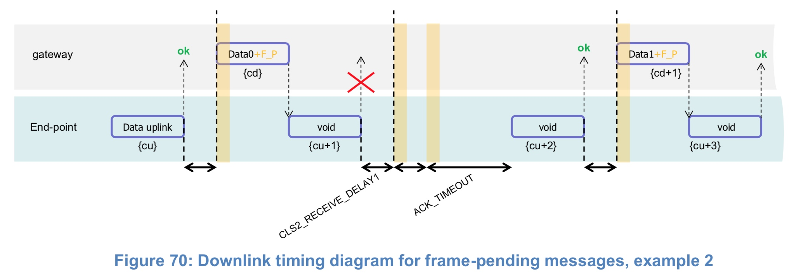
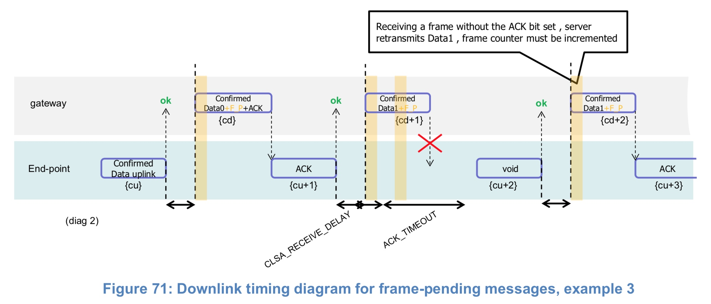

# 19 Examples and Application Information

Examples are illustrations of the LoRaWAN spec for information, but they are not part of the formal specification.

## 19.1 Uplink Timing Diagram for Confirmed Data Messages

The following diagram illustrates the steps followed by an end-device trying to transmit two confirmed data frames (Data0 and Data1). This device’s NbTrans parameter must be greater or equal to 2 for this example to be valid (because the first confirmed frame is transmitted twice)

The end-device first transmits a confirmed data frame containing the Data0 payload at an arbitrary instant and on an arbitrary channel. The frame counter Cu is simply derived by adding 1 to the previous uplink frame counter. The network receives the frame and generates a downlink frame with the ACK bit set exactly RECEIVE_DELAY1 seconds later, using the first receive window of the end-device. This downlink frame uses the same data rate and the same channel as the Data0 uplink. The downlink frame counter Cd is also derived by adding 1 to the last downlink towards that specific end-device. If there is no downlink payload pending the network shall generate a frame without a payload. In this example the frame carrying the ACK bit is not received.

If an end-device does not receive a frame with the ACK bit set in one of the two receive windows immediately following the uplink transmission it may resend the same frame with the same payload and frame counter again at least ACK_TIMEOUT seconds after the second reception window. This resend must be done on another channel and must obey the duty cycle limitation as any other normal transmission. If this time the end-device receives the ACK downlink during its first receive window, as soon as the ACK frame is demodulated, the end-device is free to transmit a new frame on a new channel.

The third ACK frame in this example also carries an application payload. A downlink frame can carry any combination of ACK, MAC control commands and payload. 

## 19.2 Downlink Diagram for Confirmed Data Messages

The following diagram illustrates the basic sequence of a “confirmed” downlink.

The frame exchange is initiated by the end-device transmitting an “unconfirmed” application payload or any other frame on channel A. The network uses the downlink receive window to transmit a “confirmed” data frame towards the end-device on the same channel A. Upon reception of this data frame requiring an acknowledgement, the end-device transmits a frame with the ACK bit set at its own discretion. This frame might also contain piggybacked data or MAC commands as its payload. This ACK uplink is treated like any standard uplink, and as such is transmitted on a random channel that might be different from channel A.

>Note: To allow the end-devices to be as simple as possible and have keep as few states as possible it may transmit an explicit (possibly empty) acknowledgement data message immediately after the reception of a data message requiring an acknowledgment. Alternatively the end-device may defer the transmission of an acknowledgement to piggyback it with its next data message.

## Downlink Timing for Frame-Pending Messages

The next diagram illustrates the use of the **frame pending** (FPending) bit on a downlink. The FPending bit can only be set on a downlink frame and informs the end-device that the network has several frames pending for him; the bit is ignored for all uplink frames.

If a frame with the FPending bit set requires an acknowledgement, the end-device shall do so as described before. If no acknowledgment is required, the end-device may send an empty data message to open additional receive windows at its own discretion, or wait until it has some data to transmit itself and open receive windows as usual.

>Note: The FPending bit is independent to the acknowledgment scheme.

(*) F_P means ‘frame pending’ bit set

In this example the network has two confirmed data frames to transmit to the end-device. The frame exchange is initiated by the end-device via a normal “unconfirmed” uplink message on channel A. The network uses the first receive window to transmit the Data0 with the bit FPending set as a confirmed data message. The device acknowledges the reception of the frame by transmitting back an empty frame with the ACK bit set on a new channel B. RECEIVE_DELAY1 seconds later, the network transmits the second frame Data1 on channel B, again using a confirmed data message but with the FPending bit cleared. The end-device acknowledges on channel C.

In this example, the downlink frames are “unconfirmed” frames, the end-device does not need to send back and acknowledge. Receiving the Data0 unconfirmed frame with the FPending bit set the end-device sends an empty data frame. This first uplink is not received by the network. If no downlink is received during the two receive windows, the network has to wait for the next spontaneous uplink of the end-device to retry the transfer. The end-device can speed up the procedure by sending a new empty data frame.

>Note: An acknowledgement is never sent twice.

The FPending bit, the ACK bit, and payload data can all be present in the same downlink. For example, the following frame exchange is perfectly valid.

The end-device sends a “confirmed data” uplink. The network can answer with a confirmed downlink containing Data + ACK + “Frame pending” then the exchange continues as previously described.

